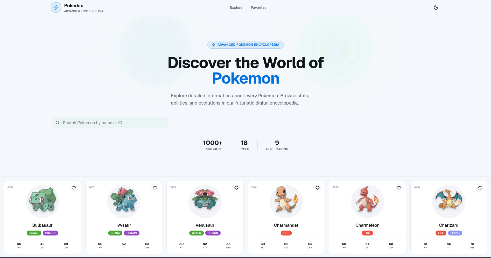
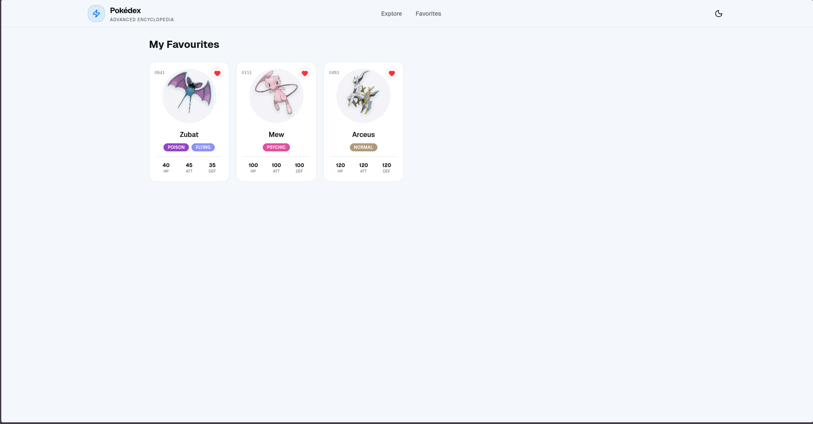
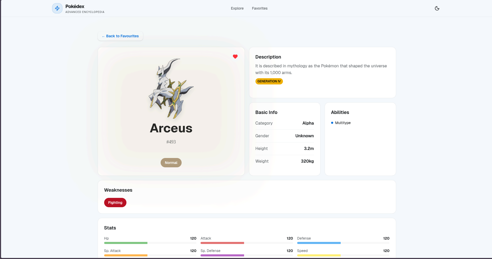

# 🎮 Pokémon Pokédex

A modern, feature-rich Pokémon explorer — built with a clean UI, responsive design, and real-time data from the PokéAPI.

**Pokémon Pokédex** lets you browse, search, and favorite Pokémon, view detailed stats, abilities, evolutions, types, weaknesses, and generation info — all in a smooth, responsive interface.

---

## ✨ Highlights

- ⚡ Fast and responsive browsing
- 🎨 Type- and generation-specific color badges
- 👤 Favorite Pokémon with one click
- 📊 Detailed Pokémon stats, abilities, and evolutions
- 🌓 Light & dark mode support
- 📱 Fully responsive for desktop, tablet, and mobile

---

## 🧠 App Concept

Explore the Pokémon universe from your browser. Each Pokémon includes:

- ✅ Name & ID
- ✅ Types with color-coded badges
- ✅ Stats with animated bars
- ✅ Abilities (including hidden abilities)
- ✅ Weaknesses and resistances
- ✅ Evolution chain with images
- ✅ Generation and category information

Favorites are stored in-browser, making it easy to quickly revisit your top Pokémon.

---

## 🛠️ Tech Stack

### Frontend

- React 18
- TailwindCSS
- Vite
- React Router DOM
- Lucide React (icons)

### Backend / Data

- PokéAPI (live Pokémon data)

---

## 🚀 Features

### ✅ Implemented

- Pokémon browsing grid
- Detailed Pokémon info pages
- Evolution chains
- Type-specific and generation badges
- Favorites management (stored in browser)
- Light & dark theme support
- Responsive layout (desktop/tablet/mobile)

### 🧩 Planned

- Multiple description versions per Pokémon (flavor text)
- Enhanced animations & transitions
- Optional backend for persistent favorites
- Video walkthrough integration

---

## 📸 Screenshots

### 🏠 Main Landing Page

<p align="center">
  
</p>

### ❤️ Favourites Page

<p align="center">
  
</p>

### 📊 Pokémon Details Page

<p align="center">
  
</p>

### Demo

<p align="center">
  
</p>

---

## 🌐 Live Demo

🔗 **Check Live Demo:**  
👉 _[Live Demo](https://js-pokedex-pi.vercel.app/)_

---

## 📂 Project Structure

```bash
src/
├── components/
│   ├── layout/
│   │   └── Navbar.jsx
│   └── pokemon/
│       ├── PokemonCard.jsx
│       ├── PokemonGrid.jsx
│       ├── StatsBar.jsx
│       └── SearchBar.jsx
├── hooks/
│   └── useFavourites.js
├── pages/
│   ├── Home.jsx
│   ├── Favourites.jsx
│   ├── PokemonDetails.jsx
│   └── NotFound.jsx
├── services/
│   └── pokeapi.js
├── index.css
└── App.css
public/
└── pokemonLogo.webp
```

---

## 🧪 Running Locally

```bash
# Clone the repository
git clone https://github.com/PrabhatKumarDev/js-pokedex.git

# Install dependencies
npm install

# Start development server
npm run dev

# Start development server and see on multiple devices
npm run dev --host 0.0.0.0
```

#### Open your browser at the localhost URL shown in the terminal.

---

## 🛣️ Roadmap

- Add animations & sound effects
- Add persistent backend for favorites
- Add video walkthrough & screenshots
- Enhance evolution and generation displays
- Production deployment

---

## 🤝 Contributing

This project is personal, but contributions, ideas, and feedback are welcome.

- Open an issue
- Start a discussion
- Submit a pull request

### 📧 Contact:

Prabhat Kumar — prabhat.kumar.hisar@gmail.com

---

## 📄 License

MIT License

---

## ⭐ Acknowledgements

- Inspired by Pokémon games and the PokéAPI project
- Powered by **PokéAPI**
- Built with ❤️ using **React + TailwindCSS**

---

## 👨‍💻 Made By

**Prabhat Kumar**
📧 Email: prabhat.kumar.hisar@gmail.com
